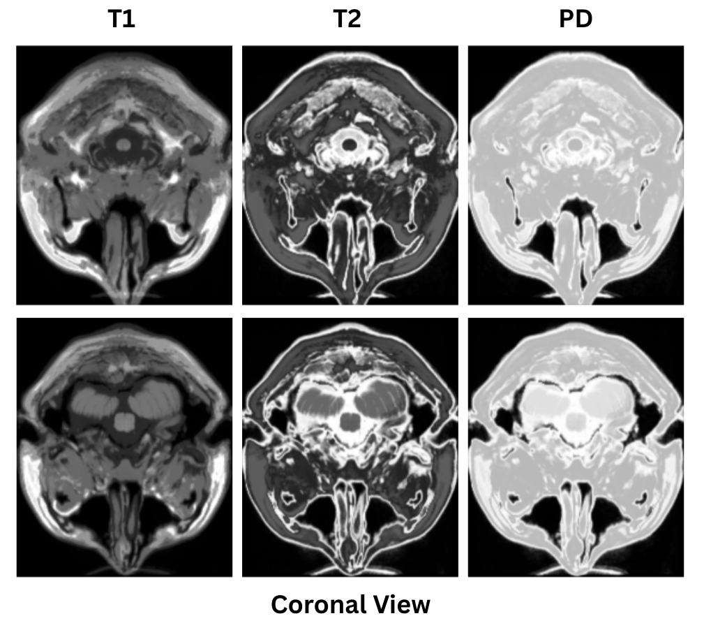
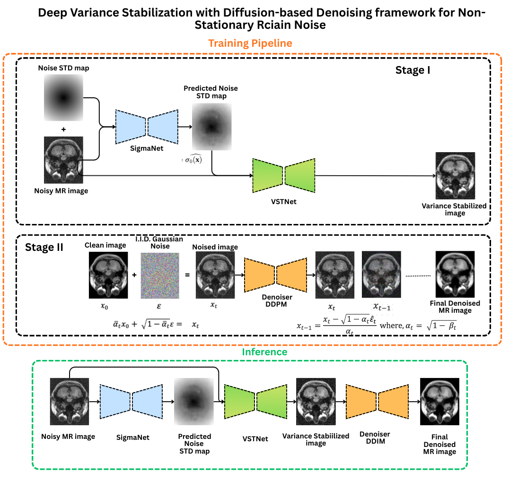
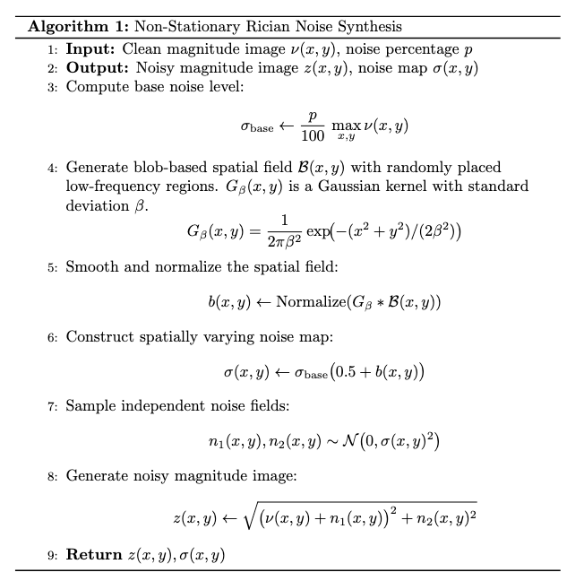
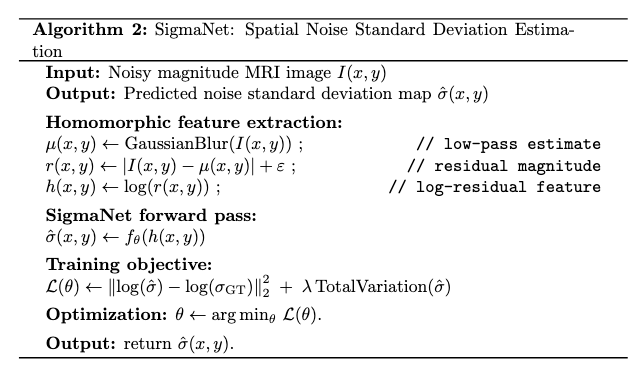
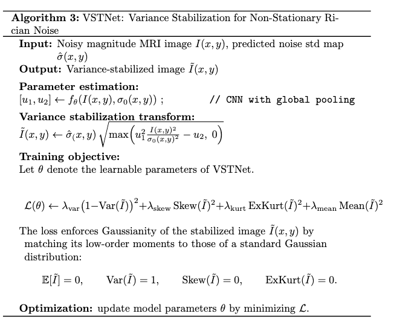
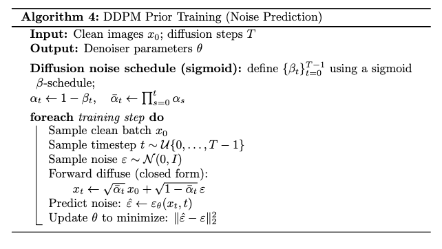
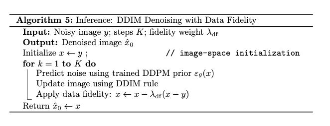
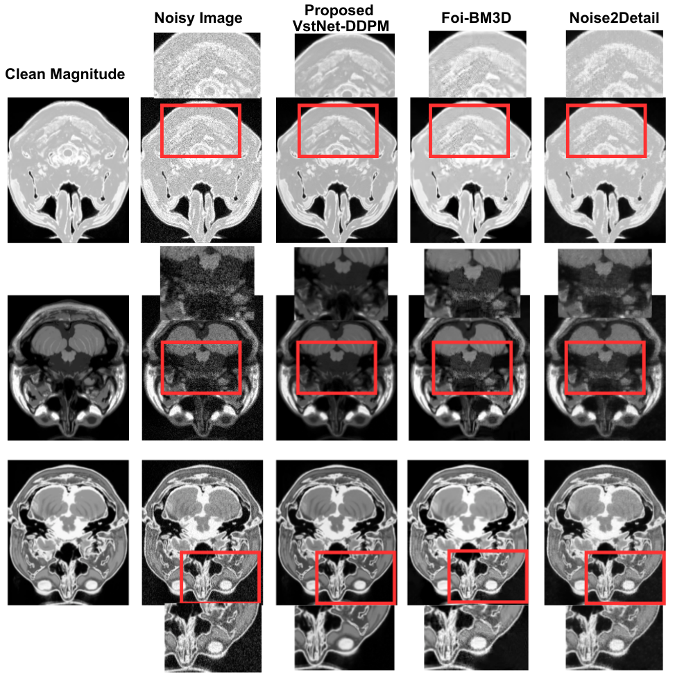

# Deep Variance Stabilization + Diffusion Denoising for Non-Stationary Rician MRI Noise


## Overview

Magnetic Resonance Imaging (MRI) magnitude images are corrupted by **Rician-distributed noise**. Classical MRI denoisers typically assume **stationary** noise, which holds approximately for ideal single-coil acquisitions.

However, in real clinical scanners with:

- multi-coil receivers
- coil sensitivity maps
- GRAPPA/SENSE reconstructions
- partial k-space acquisitions

The noise becomes **spatially varying**, leading to **non-stationary Rician noise**. This breaks assumptions made by many traditional denoisers and diffusion models trained on IID Gaussian noise. 

The objective of this project is to perform MRI denoising by integrating noise-physics-informed variance stabilization with diffusion-based denoising. The proposed framework first transforms non-stationary Rician noise in MRI magnitude images into an approximately Gaussian and spatially stationary noise distribution using variance stabilization. A diffusion model is then applied to remove the stabilized Gaussian noise.
Importantly, the diffusion model is trained only on clean images; the noisy images used in the variance-stabilization modules are never exposed to the diffusion model during training. This design minimizes dependence on paired noisy and clean ground-truth data, which are typically unavailable in real-world MRI settings.
During inference, a weighted data-fidelity term is incorporated as a regularization mechanism to enforce consistency with the observed measurements and to improve robustness when denoising previously unseen data.


To resolve this, we propose a **two-stage denoising pipeline** for training and end-to-end denoising in the inferences as follows. 


Dataset: 

We use the Simulated Brain Database (SBD) (https://brainweb.bic.mni.mcgill.ca/), which provides 3D brain MRI volumes generated from normal and multiple sclerosis (MS) anatomical models. The dataset includes T1-, T2-, and proton-density (PD) weighted images with varying slice thickness, noise levels, and intensity non-uniformity. The voxel values are in magnitude, not complex. 
In this study, we use the T1, T2, and PD modalities with slice thicknesses of 1, 3, 5, 7, and 9 mm, all generated with zero noise and zero intensity non-uniformity, which serve as ground-truth clean images. We only used the coronal 2D view slices for both training and final denoising purposes to reduce computational expenses for now. 

---
<p align="center">
  
</p>

---
The workflow of the proposed denoising pipeline is as follows: 
1. Add synthetic spatially varying Rician noise to the magnitude images. 
2. Make an estimate of the spatially varying noise. 
3. Noise variance stabilization from non-stationary Rican to approximate Gaussian distribution. 
4. Use a Diffusion model that is trained to remove Gaussian noise. 


> **Add Non-stationary Rician noise → SigmaNet → VSTNet → Diffusion → Denoised MRI**

---
<p align="center">
  
</p>

---
## Pipeline Summary
Training
### Stage I — Variance Stabilization (Physics-Informed)
#### Add spatially varying Rician noise to the magnitude images
---
<p align="center">
  
</p>
---

1. **SigmaNet** SigmaNet is a lightweight convolutional neural network designed to estimate
the spatially varying noise variance map σ₀(x) from noisy MRI
magnitude images.predicts spatial noise variance.
---
<p align="center">
  
</p>
---

2. **VSTNet** learns a data-driven variance-stabilizing transform that converts
non-stationary Rician noise into an approximately zero-mean, unit-variance
Gaussian distribution.
Given the MRI magnitude image I(x) and the spatial noise estimate σ₀(x) from
SigmaNet, VSTNet predicts two positive parameters Θ₁(x) and Θ₂(x):


### VSTNet Formulation

VSTNet predicts two spatially varying parameters at each pixel:

$$
\Theta(x) = \big(\Theta_1(x), \Theta_2(x)\big),
\qquad
\Theta_1(x) > 0,\;
\Theta_2(x) \ge 0
$$

Given the MRI magnitude image \( I(x) \) and the spatial noise estimate
\( \sigma_0(x) \), the variance-stabilized image is computed as:


$$
\tilde{I}(x) = \sigma_0(x)\sqrt{\frac{\Theta_1(x)^2 I(x)^2}{\sigma_0(x)^2} - \Theta_2(x)}
$$


### Gaussianity-Enforcing Objective

VSTNet is trained to ensure that the stabilized image \( \tilde{I}(x) \) follows
an approximately standard Gaussian distribution by minimizing a
moment-matching loss:

$$
\mathcal{J} =
\lambda_1 (1 - \mathrm{Var}(\tilde{I}))^2 +
\lambda_2 \mathrm{Skew}(\tilde{I})^2 +
\lambda_3 \mathrm{ExcessKurt}(\tilde{I})^2 +
\lambda_4 \mathrm{Mean}(\tilde{I})^2
$$

The optimal parameters are obtained as:

$$
\Theta^* = \arg\min_{\Theta} \mathcal{J}
$$

Where, 

$$
- \( \mathrm{Var}(\cdot) \) enforces unit variance  
- \( \mathrm{Skew}(\cdot) \) enforces symmetry  
- \( \mathrm{ExcessKurt}(\cdot) \) penalizes heavy tails  
- \( \mathrm{Mean}(\cdot) \) suppresses DC bias  

$$


<p align="center">
  
</p>
---

### Stage II — Denoising Diffusion 

After variance stabilization, the noise-corrupted image can be modeled as
approximately IID Gaussian.

We use a **Denoising Diffusion Probabilistic Model (DDPM)** trained exclusively
on clean MRI images. During training, DDPM corrupts clean images as:

$$
\tilde{I} = x_0 + \sigma \cdot \varepsilon, \quad \varepsilon \sim \mathcal{N}(0, 1)
$$

---
<p align="center">
  
</p>

---
After VST, the stabilized image:

$$
\tilde{I} = A_0 + \sigma(x)\,\mathcal{N}(0,1)
$$

At inference time, the stabilized image produced by VSTNet is denoised using the
pretrained DDPM. We employ DDIM sampling with a weighted data-fidelity term to
improve robustness on previously unseen data.


---
<p align="center">
  
</p>
---


## Key Contributions

✔ Handles **non-stationary Rician** MRI noise  
✔ Converts MRI noise to **Approximate Gaussian** for diffusion    
✔ Uses: DDPM for training and DDIM with weighted data fidelity for inference.  
✔ Evaluated the denoised images using Peak Signal-to-Noise Ratio (PSNR) and Structural Similarity Index Measure (SSIM) scores. 

---

# 🔧 Pipeline Steps + Commands

---

## 1. Synthetic Non-Stationary Rician Dataset

```bash
python syn_non_stat_rician_add.py \
  --in_dir <clean_mri_folder> \
  --out_dir <output_dataset_folder> \
  --n_aug 1 \
  --sigma_map_mode radial \
  --sigma_blur 25.0 \
  --percentNoise 11.0 \
  --seed 0 \
  --save_png \
  --save_clean_npy
 ```
Produces:
```bash
clean_npy/
noisy_npy/
sigma_npy/
noisy_png/
sigma_png/
manifest.csv
```
# 2. Train SigmaNet (Noise Variance Estimator)
```bash
python train_homomorphic_sigmanet.py \
  --manifest <manifest.csv> \
  --base_dir <root_dir> \
  --out_dir <sigmanet_ckpts> \
  --epochs 30 \
  --batch_size 8 \
  --lr 1e-3 \
  --wd 1e-4 \
  --val_split 0.1 \
  --blur_ksize 31 \
  --blur_sigma 7.0 \
  --base 32 \
  --input_mode h_only \
  --tv_weight 0.05 \
  --max_viz 3 \
  --amp
  ```
# 3. SigmaNet Inference
```bash
python infer_homomorphic_sigmanet.py \
  --ckpt <sigmanet_best_or_last.pth> \
  --manifest <manifest.csv> \
  --base_dir <root_dir> \
  --out_dir <sigma_predictions> \
  --input_mode h_only \
  --blur_ksize 31 \
  --blur_sigma 7.0 \
  --eval_gt
```
Produces: 
```bash
sigma_pred_npy/
sigma_pred_png/
metrics.csv
```
# 4. Train VSTNet (Variance Stabilizer)
```bash
python train_vstnet_fixed.py \
  --out_dir <vstnet_runs> \
  --synthetic 0 \
  --noisy_dir <noisy_png> \
  --sigma_dir <sigma_npy> \
  --sigma_kind npy \
  --sigma0_is_variance 0 \
  --pad_multiple 8 \
  --device cuda \
  --epochs 20 \
  --batch_size 8
```
# 5. VSTNet Inference → Generate Stabilized Images
```bash
python infer_vstnet_fixed.py \
  --ckpt <vstnet_ckpt.pt> \
  --noisy_dir <noisy_png> \
  --sigma_dir <sigma_npy> \
  --sigma_kind npy \
  --sigma0_is_variance 0 \
  --pad_multiple 8 \
  --out_dir <vst_output> \
  --device cuda \
  --batch_size 8 \
  --num_workers 2 \
  --log_every 10 \
  --use_snr_proxy 0 \
  --blur_ks 21 \
  --blur_sigma 3.0 \
  --save_extra 0
```
Outputs:
```bash
I_tilde_npy/   <-- used for diffusion training
I_tilde_png/
u1_u2.csv
```
# 6. Diffusion Training (Stage II)
```bash
python mri_denoiser_df_prior.py \
  --mode train \
  --image_size 0 \
  --train_clean <clean_folder> \
  --train_batch_size 16 \
  --train_steps 200000 \
  --timesteps 500 \
  --save_dir <output_dir>
```
# 7. Diffusion Inference
```bash
python mri_denoiser_df_prior.py \
  --mode denoise_few \
  --image_size 0 \
  --sampling_timesteps 20 \
  --timesteps 500 \
  --weights <checkpoint>.pt \
  --noisy_folder <input_folder> \
  --out_folder <output_folder> \
  --few_steps 20 \
  --eta 0.0 \
  --lambda_df 0.01
```


## Core requirements
```bash
    pip install torch numpy opencv-python scikit-learn matplotlib scikit-image pillow
 ```
## 📊 Evaluation Metrics

The denoising performance is evaluated using **Peak Signal-to-Noise Ratio (PSNR)**
and **Structural Similarity Index Measure (SSIM)**.

---

### Peak Signal-to-Noise Ratio (PSNR)

PSNR measures pixel-wise reconstruction fidelity with respect to a clean
reference image.

The mean squared error (MSE) between a clean image \( I \) and a denoised image
\( \hat{I} \) is defined as:

$$
\mathrm{MSE} = \frac{1}{N} \sum_{i=1}^{N} \left(I_i - \hat{I}_i\right)^2
$$

where \( N \) is the total number of pixels.

The PSNR (in decibels) is computed as:

$$
\mathrm{PSNR} = 10 \log_{10} \left( \frac{I_{\max}^2}{\mathrm{MSE}} \right)
$$

where \( I_{\max} \) denotes the maximum possible pixel intensity.  
Higher PSNR values indicate better denoising performance.

### Structural Similarity Index Measure (SSIM)

SSIM evaluates image quality based on luminance, contrast, and structural
similarity.

The SSIM between a clean image \( I \) and a denoised image \( \hat{I} \) is
defined as:

$$
\mathrm{SSIM}(I,\hat{I}) =
\frac{(2\mu_I \mu_{\hat{I}} + C_1)(2\sigma_{I\hat{I}} + C_2)}
{(\mu_I^2 + \mu_{\hat{I}}^2 + C_1)(\sigma_I^2 + \sigma_{\hat{I}}^2 + C_2)}
$$

where:
- \( \mu_I, \mu_{\hat{I}} \) are mean intensities  
- \( \sigma_I^2, \sigma_{\hat{I}}^2 \) are variances  
- \( \sigma_{I\hat{I}} \) is the covariance  
- \( C_1, C_2 \) are stability constants  

SSIM values range from \([-1, 1]\), with values closer to 1 indicating higher
structural similarity.

### Evaluation Protocol

- Metrics are computed against ground-truth clean images available in the
  simulated dataset.
- PSNR captures pixel-wise fidelity, while SSIM measures perceptual and
  structural similarity.
- Both metrics are reported for quantitative comparison across methods.

---

<p align="center">
  
</p>
---

### Quantitative Results

| Methodology              | PSNR (dB) | SSIM |
|--------------------------|-----------|------|
| FoI-BM3D           | 26.41    | 0.78 |
| Noise2Detail             | 26.13    | 0.67 |
| Proposed VSTNet-DDPM (Ours) | 27.49    | 0.923 |

**Baseline Methods.**

- **FoI-BM3D** is a classical non-local variance stabilization and denoising method that extends BM3D by
  incorporating a fixed variance-stabilizing transform for Rician noise.
  While effective for stationary noise assumptions, its performance degrades
  in the presence of spatially varying (non-stationary) noise.

- **Noise2Detail** is a data-driven deep learning denoiser designed to enhance
  fine structural details by learning residual noise patterns from noisy data.
  It relies primarily on learned image statistics. 


The proposed **VSTNet-DDPM** method outperforms FoI-BM3D and Noise2Detail in both
PSNR and SSIM.


## 📄 License

Released under the [MIT License](LICENSE).

##  Author

Maintained by [Israt Zarin Era](https://github.com/IE0005)
